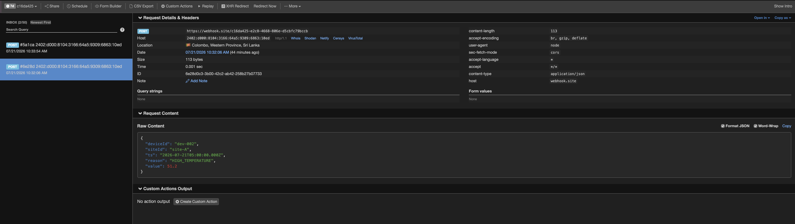
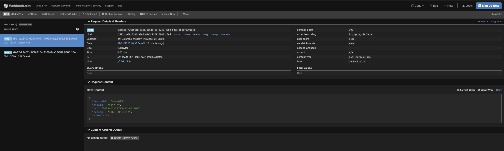

# IoT Telemetry Ingestor

A NestJS and TypeScript service that ingests IoT readings, persists them in
MongoDB, caches the latest reading for each device in Redis, sends threshold
alerts to a webhook, and exposes device and site analytics APIs.

## Features

- Accepts a single telemetry reading or an array of readings.
- Validates request DTOs and rejects unknown properties.
- Protects ingestion with a Bearer token.
- Stores telemetry in MongoDB using Mongoose.
- Caches `latest:<deviceId>` in Redis.
- Falls back to MongoDB and repairs Redis on a latest-reading cache miss.
- Sends webhook alerts when temperature is greater than `50` or humidity is
  greater than `90`.
- Deduplicates identical device alerts for 60 seconds using Redis.
- Limits ingestion to 60 readings per device per 60 seconds.
- Aggregates site metrics over an ISO timestamp range.
- Exposes dependency readiness at `GET /health`.
- Uses structured JSON logs, bounded external-service timeouts, a 1 MB request
  limit, and graceful shutdown hooks.

## Technology

- Node.js 20+
- NestJS 11 and TypeScript
- MongoDB with Mongoose
- Redis with ioredis
- Jest and Supertest

## Project setup

Install dependencies:

```bash
npm install
```

Copy the example environment file:

```bash
cp .env.example .env
```

Configure every value in `.env` before starting the application. Never commit
the `.env` file.

| Variable            | Required | Description                                                        |
| ------------------- | -------- | ------------------------------------------------------------------ |
| `NODE_ENV`          | No       | `development`, `test`, or `production`; defaults to `development`. |
| `PORT`              | No       | HTTP port from 1 to 65535; defaults to `3000`.                     |
| `MONGO_URI`         | Yes      | MongoDB or Atlas connection URI.                                   |
| `REDIS_URL`         | Yes      | Redis connection URI, such as `redis://localhost:6379`.            |
| `ALERT_WEBHOOK_URL` | Yes      | HTTPS endpoint that receives threshold alerts.                     |
| `INGEST_TOKEN`      | Yes      | Bearer token accepted by the ingest endpoint.                      |

### MongoDB

The application supports a local MongoDB instance or MongoDB Atlas. For Atlas,
create a database user, allow the application's source IP, and place the Atlas
connection string in `MONGO_URI`. Credentials are intentionally not included in
this repository.

Example local value:

```dotenv
MONGO_URI=mongodb://localhost:27017/telemetry
```

### Redis

Use an existing Redis server or start one locally with Docker:

```bash
docker run --name telemetry-redis -p 6379:6379 -d redis:7-alpine
```

Then configure:

```dotenv
REDIS_URL=redis://localhost:6379
```

### Webhook

Create a unique endpoint at [webhook.site](https://webhook.site/) and set it as
`ALERT_WEBHOOK_URL`. A reading can produce two webhook requests if both
thresholds are exceeded. Repeated alerts for the same device and reason are
suppressed for 60 seconds. Webhook failures are logged without rolling back a
reading that has already been persisted.

### Webhook verification evidence

Webhook.site endpoint:
[https://webhook.site/c16da425-e2c8-4668-806e-d5cbfc79bccb](https://webhook.site/c16da425-e2c8-4668-806e-d5cbfc79bccb)

High-temperature alert:



High-humidity alert:



## Running the application

```bash
# Development with file watching
npm run start:dev

# Production build
npm run build
npm run start:prod
```

The API is available at `http://localhost:3000/api/v1` by default.

## API

### Ingest telemetry

```http
POST /api/v1/telemetry
Authorization: Bearer <INGEST_TOKEN>
Content-Type: application/json
```

Single-reading example:

```bash
curl -X POST http://localhost:3000/api/v1/telemetry \
  -H "Authorization: Bearer secret123" \
  -H "Content-Type: application/json" \
  -d '{
    "deviceId": "dev-002",
    "siteId": "site-A",
    "ts": "2025-09-01T10:00:30.000Z",
    "metrics": {
      "temperature": 51.2,
      "humidity": 55
    }
  }'
```

The endpoint also accepts an array containing the same object structure. It
returns `201 Created`. Missing or invalid authentication returns
`401 Unauthorized`. A device that exceeds 60 readings in a 60-second window
receives `429 Too Many Requests`; batch readings are counted per device.

### Get the latest device reading

```http
GET /api/v1/devices/:deviceId/latest
```

```bash
curl http://localhost:3000/api/v1/devices/dev-002/latest
```

Example response:

```json
{
  "source": "redis",
  "data": {
    "_id": "...",
    "deviceId": "dev-002",
    "siteId": "site-A",
    "ts": "2025-09-01T10:00:30.000Z",
    "metrics": {
      "temperature": 51.2,
      "humidity": 55
    }
  }
}
```

`source` is `redis` for a valid cache hit and `mongodb` when MongoDB fallback
was used. A missing device returns `404 Not Found`.

### Get a site summary

```http
GET /api/v1/sites/:siteId/summary?from=<ISO>&to=<ISO>
```

```bash
curl "http://localhost:3000/api/v1/sites/site-A/summary?from=2025-09-01T00:00:00.000Z&to=2025-09-02T00:00:00.000Z"
```

Example response:

```json
{
  "count": 2,
  "avgTemperature": 35.6,
  "maxTemperature": 51.2,
  "avgHumidity": 65,
  "maxHumidity": 75,
  "uniqueDevices": 2
}
```

For an empty range, `count` and `uniqueDevices` are `0`; aggregate metric
values are `null`. A range where `from` is after `to` returns `400 Bad Request`.

### Check application health

```http
GET /health
```

```bash
curl http://localhost:3000/health
```

The endpoint actively checks MongoDB and Redis with a two-second timeout. It
returns `200 OK` when both dependencies are available:

```json
{
  "status": "ok",
  "checks": {
    "mongodb": "up",
    "redis": "up"
  }
}
```

It returns `503 Service Unavailable` when either dependency is down. Connection
details and credentials are never included in the response.

## Alert payload

Temperature above `50` produces `HIGH_TEMPERATURE`; humidity above `90`
produces `HIGH_HUMIDITY`.

```json
{
  "deviceId": "dev-002",
  "siteId": "site-A",
  "ts": "2025-09-01T10:00:30.000Z",
  "reason": "HIGH_TEMPERATURE",
  "value": 51.2
}
```

## Design decisions

- MongoDB is the source of truth; Redis contains reconstructable latest-reading
  cache data.
- MongoDB is queried before refreshing cache entries after ingestion, preventing
  an older, late-arriving reading from replacing the actual latest reading.
- Cache and webhook failures do not discard telemetry already persisted in
  MongoDB.
- Compound indexes on `{ deviceId, ts }` and `{ siteId, ts }` support the latest
  and summary access patterns.
- External configuration is validated at startup so invalid URLs, ports, or
  missing secrets fail fast.

## Testing

```bash
# Unit tests
npm test

# E2E API tests
npm run test:e2e

# Build and lint
npm run build
npm run lint
```

The Supertest E2E suite runs the real NestJS controllers, guards, validation,
services, and HTTP routes with deterministic in-memory MongoDB and Redis test
doubles. It does not require external infrastructure or expose credentials in
CI. It covers authenticated ingestion, alert delivery, Redis cache use,
MongoDB fallback, cache repair, and summary aggregation.

## AI assistance disclosure

- AI was used to review the assignment and propose a small NestJS module and
  configuration structure.
- AI-generated DTO validation, MongoDB schema, cache-flow, and webhook logic
  were reviewed and adjusted to match the required payloads and thresholds.
- AI helped identify edge cases including batch validation, out-of-order
  telemetry, corrupt Redis entries, invalid date ranges, and webhook failures.
- AI assisted with Jest and Supertest test scaffolding; assertions and expected
  behaviors were checked against the assignment requirements.
- All generated changes were compiled, linted, tested, and manually reviewed;
  responsibility for correctness and security remains with the submitter.
